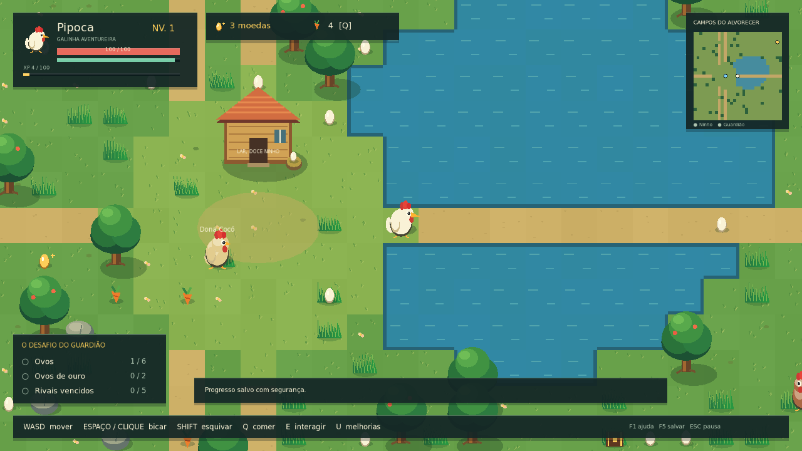

# Meu Galinheiro — Aventura nos Campos

Jogo top-down em **C++20 + SFML 3.0.2**, com mundo procedural por chunks, combate em tempo real, progressão e save JSON. Controle **Pipoca**, uma galinha aventureira, explore os Campos do Alvorecer e conquiste o título de guardiã do galinheiro.



A direção visual segue a referência de Zelda enviada: composição vista de cima, cores rurais, volume por sombras, vegetação em camadas e ataques legíveis. O cenário é original, desenhado proceduralmente. O personagem usa atlas preparados com imagegen a partir da referência de sprites enviada pelo usuário; não usa recursos de Zelda.

## Jogar no celular e telas touch

A pasta `web/` contém a versão de navegador, com o **mesmo núcleo de gameplay C++20 compilado em WebAssembly**, apresentação Canvas 2D e controles responsivos para Android, iPhone e computadores. Não é um APK nem um executável iOS.

- Analógico esquerdo com zona morta e intensidade de movimento.
- Botão **Bicar** à direita; mover e atacar simultaneamente com dois dedos.
- Botões **Esquiva**, **Comer** e **Usar**, pausa, oficina e **Bolsa** acessíveis por toque.
- Inventário Web pela tecla **I**, com quantidades e uso de alimentos.
- Ovos comuns e dourados aparecem somente após derrotar inimigos; drops e coleta persistem no save.
- Layout em retrato ou paisagem, captura/cancelamento de pointers e pausa ao perder foco.
- Saves JSON no armazenamento local do navegador, separados do save Windows.
- Render com DPR limitado a 1,5 para conter custo em telas de alta densidade.

Para publicar no GitHub Pages, use a branch `gh-pages`, raiz `/`, em **Settings → Pages → Deploy from a branch**. O endereço esperado após ativar é `https://aminhagranja-sketch.github.io/paulo/`. A publicação precisa estar ativa antes de esse endereço funcionar.

Para desenvolver localmente:

```bash
./scripts/bootstrap-web-cloud.sh # apenas na nuvem Debian; ou use em++ do emsdk
python3 -m http.server 8088 --directory web
```

Abra o servidor local no navegador da sua máquina. Não abra `index.html` como arquivo: o navegador precisa buscar o módulo WASM por HTTP/HTTPS. A pasta web inclui os arquivos compilados e pode ser hospedada como site estático.

Recompilar com emsdk: configure o núcleo para obter JSON e execute `GRANJA_JSON_INCLUDE=/caminho/para/nlohmann/include ./scripts/build-web.sh`. A versão validada de Emscripten é 3.1.69.

Testes de navegador: `npm ci`, `npx playwright install chromium` e `npm run test:web` com o servidor em execução. O Playwright faz parte apenas da validação.

No Windows, os controles virtuais também aceitam mouse e toque; **F2** exibe/oculta os controles. Como o SFML Win32 não fornece multitouch, `NativeTouch.cpp` adapta os eventos nativos `WM_POINTER` para o mesmo controlador. Esse caminho precisa de validação em equipamento Windows touch real.

## Evolução para o pedido multiplayer

O processamento das sete folhas está documentado em [SPRITES.md](docs/SPRITES.md).
A nova regra de ovos e o inventário Web já funcionam. Saves v1 são migrados para
v2 preservando inventário; ovos antigos espalhados pelo mapa foram removidos.

A versão atual ainda é individual, com Canvas 2D e salvamento local. Servidor
autoritativo, cooperação, PostgreSQL, câmera Babylon 2.5D, portas animadas e
integração das sete folhas originais permanecem pendentes. As imagens exibidas
na conversa ainda não estão disponíveis como PNGs locais verificáveis.

## Jogar no Windows

**[Baixar jogo Windows (.zip)](https://github.com/aminhagranja-sketch/paulo/raw/refs/heads/main/downloads/MeuGalinheiro-Windows.zip)**

O pacote gerado contém `meu_galinheiro.exe` e a pasta `assets`. Extraia o ZIP inteiro e execute o `.exe`, mantendo `assets` ao lado. Saves vão para `%LOCALAPPDATA%\MeuGalinheiro\save.json`.

### Compilar a partir do código

Pré-requisitos:

- Windows 10/11 x64.
- Visual Studio 2022 com **Desenvolvimento para desktop com C++** e Windows SDK.
- CMake **3.25 ou superior** para os presets (o projeto sem presets aceita 3.24).
- Git instalado e disponível no `PATH`.
- Acesso ao GitHub na primeira configuração para baixar SFML, JSON e FreeType.

No PowerShell, a partir da raiz:

```powershell
./scripts/build-windows.ps1 -Run
```

Ou execute os comandos individualmente:

```powershell
cmake --preset windows
cmake --build --preset windows --parallel 4
ctest --preset windows
./build/windows/Release/meu_galinheiro.exe
```

O script também gera `build/MeuGalinheiro-Windows.zip`. O SFML e o JSON são obtidos automaticamente pelo CMake; não é necessário instalar SFML manualmente. O build MSVC usa o runtime padrão do compilador; em máquinas de destino, instale o Microsoft Visual C++ Redistributable x64 quando necessário. O pacote compilado aqui com MinGW usa runtimes estáticos e depende apenas de DLLs do Windows.

## Objetivo e sistemas

1. Explore os campos, bosques e lagos. Há um pomar secreto com tesouros.
2. Colete **6 ovos**, **2 ovos de ouro** e vença **5 galinhas rivais**.
3. Ganhe moedas e XP. Suba de nível e compre melhorias no ninho.
4. Encontre o **Galo Guardião** na marca dourada do minimapa e vença o combate final.
5. Após a vitória, continue explorando o mesmo mundo.

Ovos, alimentos e baús são coletados por proximidade. Baús dão 40 moedas, dois alimentos e XP. Galinhas rivais dão moedas e XP conforme sua força. O Guardião fica selado até cumprir a missão.

Ataques custam energia e acertam um arco à frente. Inimigos anunciam o golpe com uma área vermelha antes de atacar. Esquive para evitar dano, respeitando o custo de energia. Alimentos curam 45 pontos; não são consumidos com vida cheia. Ao perder toda a vida, você retorna ao ninho e perde 10% das moedas, mantendo os outros itens.

**Dona Cocó** fica no ninho: interagir restaura vida e energia e salva. Melhorias custam `30 + nível da melhoria × 25` moedas, com cinco níveis por atributo. Cada evolução aumenta vida máxima e ataque, e restaura a vida.

## Controles

| Tecla | Ação |
|---|---|
| Enter / N, no título | Continuar ou começar / nova aventura |
| WASD ou setas | Mover |
| Espaço | Bicar na direção atual |
| Clique esquerdo | Mirar e bicar na direção do cursor |
| Shift | Esquivar, com breve invulnerabilidade |
| Q | Comer alimento |
| E | Interagir; descansar e salvar no ninho |
| U | Abrir oficina no ninho |
| 1 / 2 / 3 | Comprar vida / ataque / velocidade, perto do ninho |
| F1 / F2 | Guia de campo / mostrar controles touch |
| F5 / F9 | Salvar / carregar |
| Esc | Fechar painel ou pausar/retomar |

A simulação para ao perder foco ou abrir menus. Há autosave a cada 45 segundos de jogo, ao descansar, comprar melhorias, morrer, vencer e fechar a janela após iniciar uma partida. **Nova aventura usa o mesmo slot**: o save anterior será substituído no próximo salvamento. Faça uma cópia de `save.json` para guardar outra partida. F9 descarta o progresso ainda não salvo.

## Linux

Em Debian/Ubuntu, instale CMake, Ninja, Git, compilador C++20, `libx11-dev`, `libxrandr-dev`, `libxcursor-dev`, `libxi-dev`, `libudev-dev`, `libfreetype-dev` e `libgl1-mesa-dev`:

```bash
cmake --preset linux
cmake --build --preset linux --parallel 4
ctest --preset linux
./build/linux/meu_galinheiro
```

Sem display, apenas os testes do núcleo:

```bash
cmake --preset core
cmake --build --preset core --parallel 4
ctest --preset core
```

No ambiente de nuvem Debian deste projeto:

```bash
./scripts/bootstrap-cloud.sh
source scripts/cloud-env.sh
./scripts/validate-graphics.sh
```

O bootstrap usa um sysroot local em `/workspace/toolchain`, com pacotes Debian autenticados por APT, sem alterar o sistema. `validate-graphics.sh` abre um Xvfb temporário, executa o jogo, coleta um item, renderiza 130 frames, salva, recarrega e gera uma captura. `cloud-env.sh` direciona caches e saves para pastas graváveis deste checkout (`build/cache` e `.local/share`). Esse fluxo é uma validação automática; para jogar interativamente use uma sessão gráfica local.

Para gerar o pacote Windows por compilação cruzada nessa mesma nuvem:

```bash
./scripts/build-windows-cross.sh
```

## Estrutura

```text
include/granja/       Tipos e interfaces dos módulos
src/World.cpp         Terreno, colisão, geração e streaming
src/Simulation.cpp    Jogador, combate, IA, economia e missão
src/Save.cpp          Serialização e carregamento transacional
src/Renderer.cpp      Arte, animações, câmera, menus, HUD e minimapa
src/Game.cpp          Janela, eventos, loop fixo e autosave
src/main.cpp          Entrada e parâmetros de execução
tests/core_tests.cpp  Testes independentes de display
assets/fonts/         Fonte e licença embarcadas
cmake/                Toolchains opcionais da nuvem
scripts/              Compilação, empacotamento e validação
.github/workflows/    CI para Windows e Linux
docs/                 Arquitetura, validação e licenças
```

A arquitetura é modular, com dados de entidades separados da apresentação. Consulte [arquitetura](docs/ARCHITECTURE.md) e [validação](docs/VALIDATION.md).

## Salvamento e opções

JSON versionado com seed, jogador, itens coletados e estado dos inimigos das áreas exploradas. A gravação usa um arquivo temporário e substituição atômica; uma falha no carregamento preserva a simulação atual. O arquivo não contém credenciais.

- Windows: `%LOCALAPPDATA%\MeuGalinheiro\save.json`.
- Linux: `$XDG_DATA_HOME/meu-galinheiro/save.json` ou `~/.local/share/meu-galinheiro/save.json`.
- `--save <arquivo>`: trocar o slot.
- `--assets <diretório>`: indicar recursos quando o executável está em outra pasta.
- `--smoke`: validação gráfica automática; sem `--save`, cria um slot temporário isolado.
- `--help`: ajuda de linha de comando.

## Escopo desta versão

Uma aventura solo completa até o chefe final, com um NPC de apoio, uma família de rivais com quatro níveis de força, três melhorias, quatro tipos de recompensa, um local secreto e terreno procedural. A interface usa coordenadas base 1920×1080 com letterboxing; a janela inicial é 1280×720. A simulação é fixa em 60 Hz e o render tem limite de 60 FPS, dependente do hardware.

A apresentação combina cenário 2D vetorial e sprites PNG animados para Pipoca. Os atlas contêm caminhada em quatro direções, ataque, esquiva, dano e vitória; idle usa o primeiro quadro da direção. Não reproduz a renderização 3D/tilt-shift da imagem de referência. Esta versão não inclui áudio, multiplayer, gamepad, APK nativo, construção de fazenda ou campanhas adicionais.

Código sob MIT; veja [licenças de terceiros](THIRD_PARTY.md).
